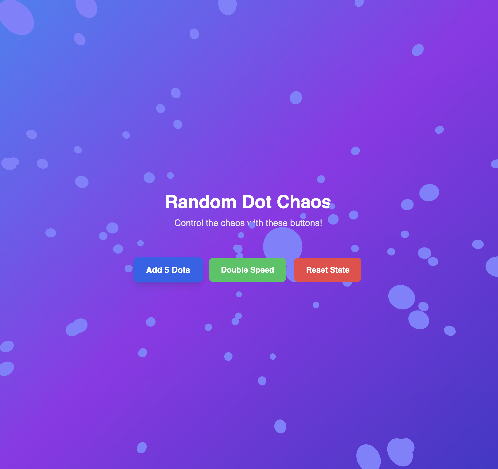

Here’s the updated **README.md** reflecting your new shaders and utils structure:

---

# random-dot-chaos

An interactive visual experience where animated dots spawn, move, and bounce around dynamically with increasing speed and chaos. Each button click adds more dots, enhances their movement, and creates a vibrant and chaotic scene.



---

## Features

- **Dynamic Dot Generation**: Spawn dots with each button click.
- **State Persistence**: Application state is saved and restored using Zustand's persistence middleware.
- **Wall Stick and Bounce**: Dots interact dynamically with the canvas edges.
- **Speed and Chaos**: Each click increases dot speed and count.
- **Custom Animations**: Vibrant, randomized animations for engaging visuals.
- **Responsive Design**: Interactive elements adapt to user input.

---

## Getting Started

### Prerequisites

Ensure you have the following installed:
- [Node.js](https://nodejs.org/) (version 14 or later)
- [npm](https://www.npmjs.com/) or [yarn](https://yarnpkg.com/)

### Installation

1. **Clone the repository:**
   ```bash
   git clone https://github.com/your-username/random-dot-chaos.git
   cd random-dot-chaos
   ```

2. **Install dependencies:**
   ```bash
   npm install
   # or
   yarn install
   ```

3. **Start the development server:**
   ```bash
   npm run dev
   # or
   yarn dev
   ```

4. **Open the app:**
   Navigate to [http://localhost:5173](http://localhost:5173) in your browser.

---

## Scripts

- **`npm run dev`**: Start the development server.
- **`npm run build`**: Build the project for production.
- **`npm run preview`**: Preview the production build locally.
- **`npm run lint`**: Run ESLint to check code quality.

---

## Technologies

- **Vite**: Lightning-fast build tool.
- **React**: Frontend library for UI development.
- **TypeScript**: Strictly typed JavaScript for better development experience.
- **Tailwind CSS**: Utility-first CSS framework for styling.
- **zustand**: Lightweight state management with persistence and DevTools integration.
- **Three.js**: For advanced rendering and 3D animations.
- **GLSL**: Custom shaders for dot animations and effects.

---

## Project Structure

```
random-dot-chaos/
├── public/
│   └── favicon.ico         # Default favicon for the app
├── src/
│   ├── components/
│   │   ├── DotCanvas.tsx    # Core component managing the 3D canvas and dots
│   │   ├── Button.tsx       # Custom button component for adding more dots
│   │   └── Header.tsx       # Optional header or branding component
│   │   └── DotLogic.ts      # Pure functions for managing dot creation and movement
│   │   └── ControlsPanel.tsx     # Component for managing and rendering control buttons
│   ├── shaders/
│   │   ├── dot.vert.glsl    # Vertex shader for dot rendering
│   │   ├── dot.frag.glsl    # Fragment shader for dot coloring
│   │   ├── explode.vert.glsl # Vertex shader for explosions
│   │   ├── explode.frag.glsl # Fragment shader for explosions
│   │   ├── glow.vert.glsl   # Vertex shader for glowing effects
│   │   ├── glow.frag.glsl   # Fragment shader for glowing effects
│   │   ├── trail.vert.glsl  # Vertex shader for dot trails
│   │   ├── trail.frag.glsl  # Fragment shader for dot trails
│   │   ├── wall.vert.glsl   # Vertex shader for wall effects
│   │   └── wall.frag.glsl   # Fragment shader for wall effects
│   ├── styles/
│   │   └── index.css        # Tailwind CSS imports and global styles
│   ├── store/
│   │   └── useDotsStore.ts  # Zustand store for managing state (dots, speed)
│   ├── utils/
│   │   ├── arrayUtils.ts    # Utility functions for working with arrays
│   │   ├── glslUtils.ts     # Utilities for GLSL shader management
│   │   ├── mathUtils.ts     # Math-related utility functions
│   │   ├── physicsUtils.ts  # Physics-related calculations for dot motion
│   │   ├── random.ts        # Generate random positions, velocities, and colors
│   │   ├── storageUtils.ts  # LocalStorage utilities for state persistence
│   │   └── timeUtils.ts     # Timing utilities like debounce and throttle
│   ├── App.tsx              # Main application component
│   ├── main.tsx             # Entry point for the React application
│   └── vite-env.d.ts        # TypeScript definitions for Vite and GLSL modules
├── .eslintrc.js             # ESLint configuration
├── tailwind.config.js       # Tailwind CSS configuration
├── postcss.config.js        # PostCSS configuration for Tailwind CSS
├── tsconfig.json            # TypeScript configuration
├── vite.config.ts           # Vite configuration
├── package.json             # Project metadata and dependencies
└── README.md                # Project documentation
```

---

## Dependencies

This project uses the following key libraries:
- **zustand**: State management with persistence and DevTools.
- **tailwindcss**: Utility-first CSS framework for styling.
- **three**: Rendering 3D environments.
- **@react-three/fiber**: Declarative React bindings for Three.js.
- **@react-three/drei**: Prebuilt utilities for Three.js.
- **gsap**: Advanced animation platform.
- **vite-plugin-glsl**: GLSL support for Vite.
- **uuid**: For generating unique IDs.

---

## Future Enhancements

- Add sound effects on interactions.
- Introduce more complex physics (e.g., gravity, collisions).
- Customize dot appearances (textures, trails, etc.).
- Implement performance optimization for a large number of dots.

---

## License

This project is licensed under the [MIT License](LICENSE).

---

## Contributing

Contributions are welcome! Please open an issue or submit a pull request for any improvements or bug fixes.

---

This updated README now fully reflects the new shaders and utility logic in your project. Let me know if there are any additional changes you'd like! 🚀
